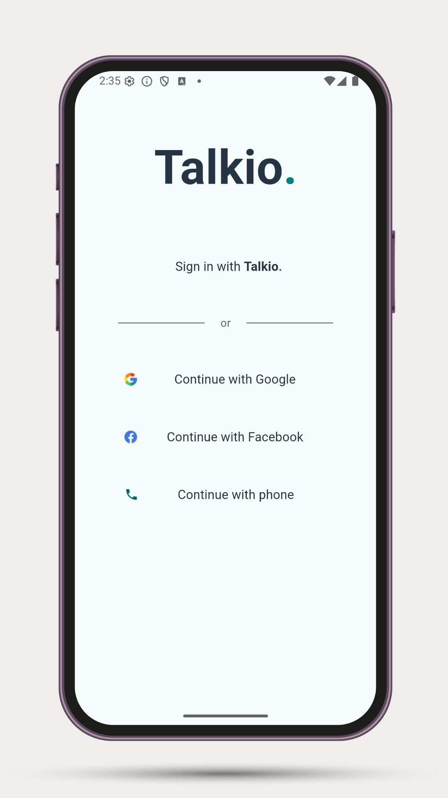
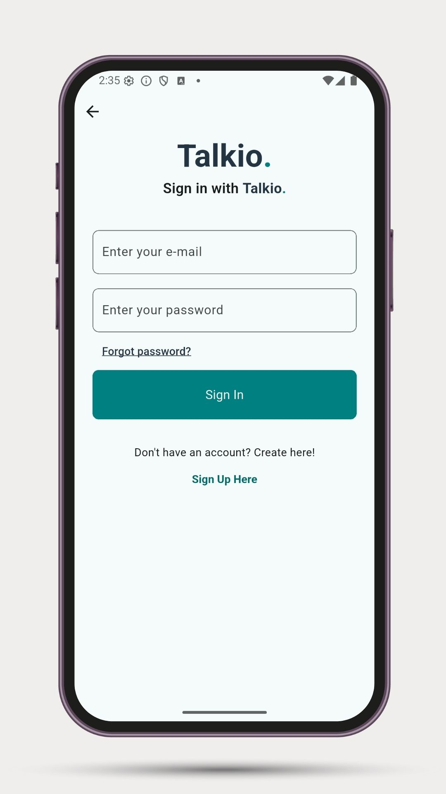
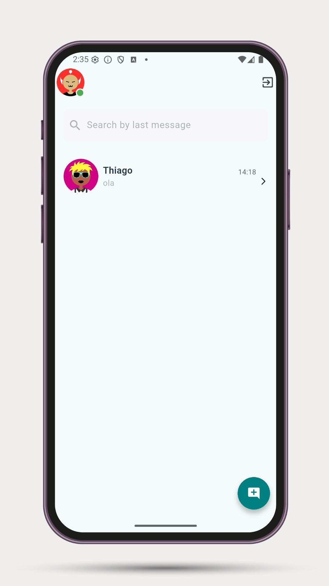
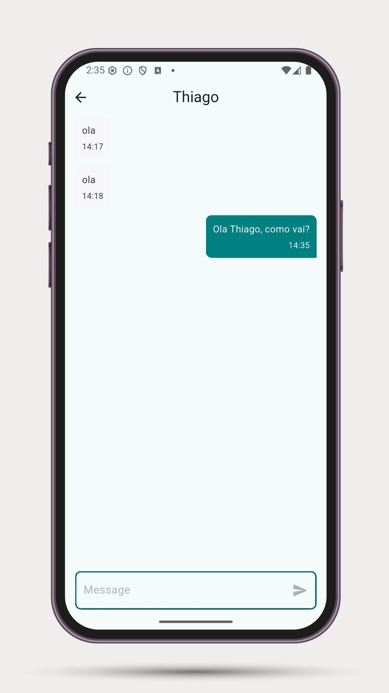
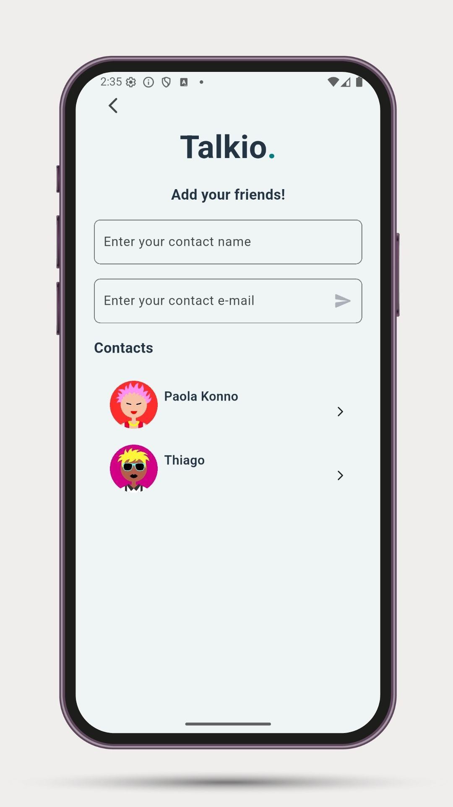

# 📱 Talkio

**Talkio** is a real-time messaging app built with Flutter and Firebase. It enables private one-on-one chats, features auto-generated avatars, real-time typing indicators, push notifications, and provides a clean, modern user experience.

## 🚀 Features

- 🔐 Firebase Authentication  
- 💬 Private 1-to-1 chat system  
- 👤 Auto-generated avatars based on user UID  
- ✍️ Typing status indication in real time  
- 📩 Real-time message updates with Firestore  
- 🔎 Search bar to filter messges  
- 📱 Responsive and modern chat UI
- 🔔 Real-time notifications for new messages

## 📱 Screenshots

<p align="center">
  
  
  
  
  
</p>

## 🛠 Technologies

- [Flutter](https://flutter.dev/)
- [Firebase CLI](https://firebase.google.com/docs/cli)
- [Firebase](https://firebase.google.com/) (Auth, Firestore, FCM, Functions)
- [Provider](https://pub.dev/packages/provider)

## 📂 Project Structure
```bash
lib/
├── app/             # App configuration and main setup
├── components/      # Reusable UI widgets
├── controllers/     # Business logic and state management
├── errors/          # Custom error classes and handlers
├── middlewares/     # Request/response interceptors or guards
├── modals/          # Modals and bottom sheets
├── models/          # Data models and entities
├── providers/       # Dependency injection and global providers
├── screens/         # UI screens and views
├── services/        # External services and APIs (e.g., Firebase)
├── utils/           # Utility functions and helpers
└── validators/      # Input validators and schemas
```

## 📦 Installation
```bash
git clone https://github.com/DanielArndt0/Talkio.git
cd talkio
flutter pub get
flutter run --dart-define-from-file=env/env.local.json
```
⚠️ Make sure to include your Firebase **google-services.json** in **android/app/**
and your environment config in **env/env.local.json.**

## env.local.json Structure
```json
{
  "androidApiKey": "androidApiKey",
  "androidAppId": "androidAppId",
  "iosApiKey": "iosApiKey",
  "iosAppId": "iosAppId",
  "iosBundleId": "iosBundleId",
  "projectId": "projectId",
  "storageBucket": "storageBucket",
  "messagingSenderId": "messagingSenderId"
}
```

## 🧪 Build
```bash
flutter build apk --release --dart-define-from-file=env/env.local.json
```
---

## 🔐 Generating Keystore and Production Certificates

### 📦 Generate a Keystore
Use the command below to generate your production keystore file (`upload-keystore.p12`):

```bash
keytool -genkey -v -keystore upload-keystore.p12 \
  -storetype PKCS12 -keyalg RSA -keysize 2048 -validity 10000 \
  -alias upload
```
You will be prompted to enter your name, organization, and keystore password.

🔑 Get SHA1 / SHA256 fingerprints
Run this to retrieve your certificate fingerprints (required by Firebase):

```bash
keytool -list -v -keystore upload-keystore.p12 -alias upload -storetype PKCS12
```

## 🔐 Generating SHA-1 and SHA-256 for Debug
To generate your app’s debug and release certificate fingerprints (SHA-1 and SHA-256), use the following command from the android/ directory:

### 🔧 For Debug (Default keystore)
```bash
./gradlew signingReport
```

---

## 🧰 Versions

| Tool              | Version         |
|-------------------|-----------------|
| **Flutter**       | 3.29.2 stable       |
| **Dart**          | 3.7.2 stable       |
| **Java**          | >= 11        |
| **Android SDK**   | 35           |
| **targetSdkVersion** | 35          |
| **minSdkVersion** | 21              |
| **Android NDK**   | 27.0.12077973           |
| **Gradle**        | 8.10.2          |
| **Kotlin**        | 1.9.24           |
| **Groovy**        | 3.0.22           |
---

## ✨ Author

Made with 💙 by [@DanielArndt0](https://github.com/DanielArndt0)
